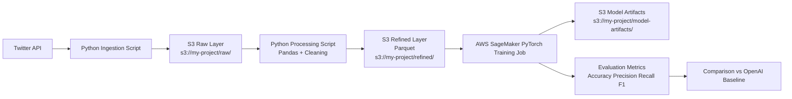

# Bot Detection on Social Media

## Project Snapshot

- Developed transformer-based bot detection system trained on AWS SageMaker, setting OpenAI's API as a baseline, and outperforming it by 18% in accuracy (76% vs 58%).
- Built a data pipeline by ingesting 100K+ tweets from Twitter API, cleaning textual data with Python, and loading it into PyTorch for model training.

## Data Flow with Model Training on AWS SageMaker

### The Data Flow when I collected data via Twitter API

1. Ingestion: Python script fetches 100K+ tweets from Twitter API.
2. Storage (Raw): Save raw JSON/dictionary records to S3.
3. Processing (Pandas): Load raw data from S3 into Pandas, clean text, and prepare BERT tokenization fields.
4. Storage (Processed): Save cleaned dataset back to S3 as Parquet.
    - **Why Parquet**:
    - Faster than CSV for large ML datasets.
    - Preserves column types better for downstream training.
    - Efficient compression and scan performance.
5. Training (SageMaker): Point SageMaker Training Job to the refined S3 folder so training containers can read the data.

## Architecture Diagram

